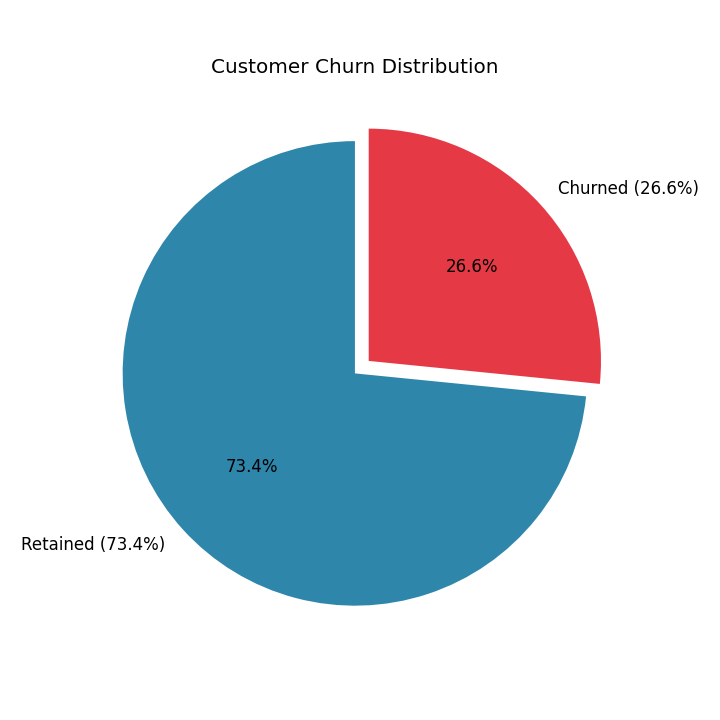
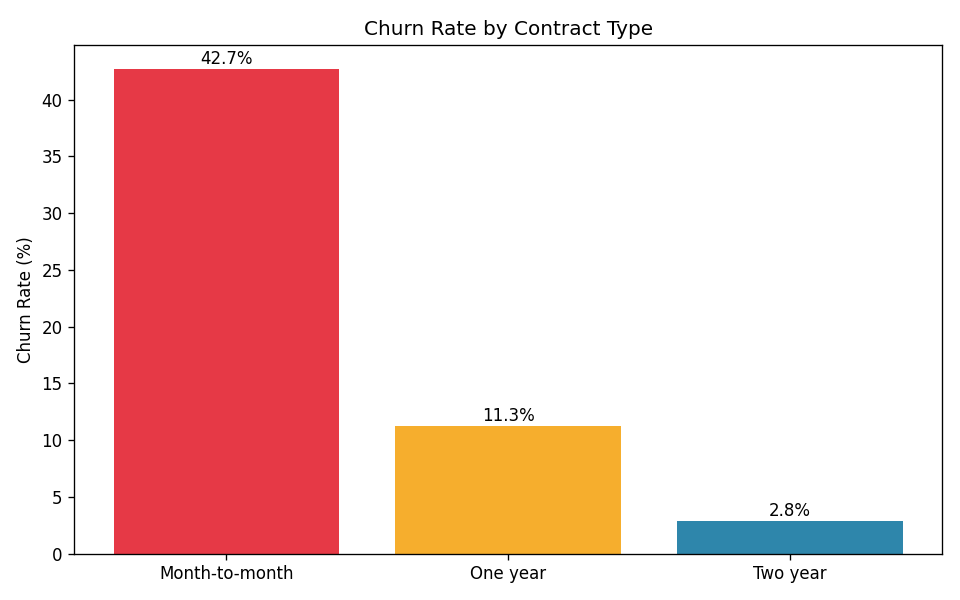
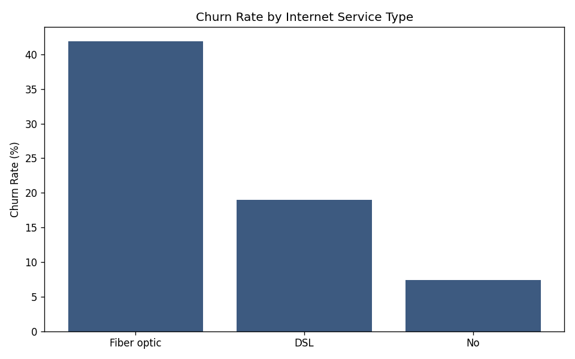
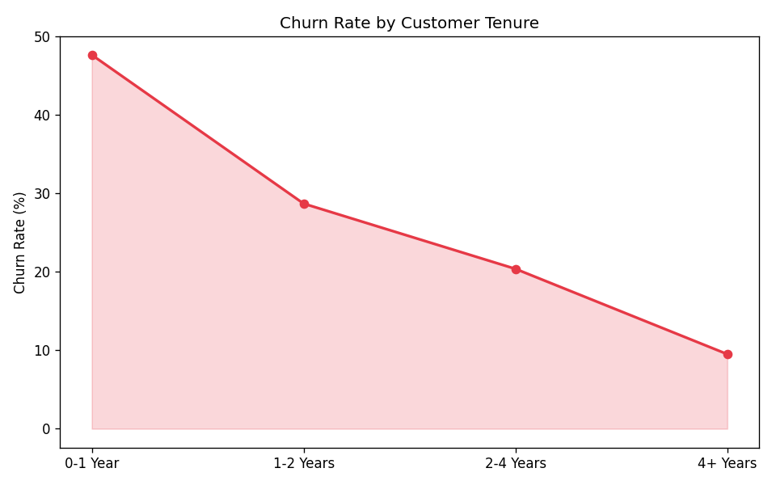
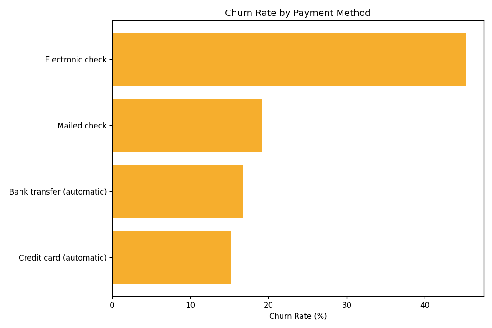

# 📞 Telco Customer Churn Analysis

> Data-driven analysis of telecom customer churn to identify key drivers of customer attrition and support retention strategy.

## 📌 Overview

This project analyzes **7,032 telecom customer records** to understand why customers churn (leave the service). Using SQL for data extraction and Python (Pandas/Matplotlib) for visualization, the analysis identifies high-risk customer segments based on contract type, services, billing, and tenure.

**Dataset source:** [Telco Customer Churn (Kaggle)](https://www.kaggle.com/datasets/blastchar/telco-customer-churn)

## 🛠️ Tech Stack

- **SQL (SQLite)** – Data extraction and querying
- **Python (Pandas, Matplotlib)** – Data processing and visualization
- **CSV** – Raw data source

## 🔍 What I Did

- Cleaned and prepared 7,032 customer records (handled missing values in billing data)
- Wrote SQL queries to analyze churn rate across **contract type**, **internet service**, **payment method**, **tenure**, and **customer demographics**
- Built visualizations to highlight the strongest churn indicators
- Identified the highest-risk customer segment to support targeted retention strategy

## 📊 Key Insights (from actual analysis)

- **Overall churn rate is 26.58%** (1,869 out of 7,032 customers churned)
- **Contract type is the single strongest churn driver**: Month-to-month customers churn at **42.71%**, vs. just **11.28%** for one-year contracts and **2.85%** for two-year contracts
- **Fiber optic internet customers churn at 41.89%**, more than double the rate of DSL customers (19%) — possibly due to pricing or service reliability issues
- **Electronic check users have the highest churn rate (45.29%)** among all payment methods, while automatic payment methods (bank transfer/credit card) show much lower churn (~15-17%)
- **New customers are highest risk** — churn rate is **47.68% in the first year**, dropping steadily to just **9.51% for customers with 4+ years of tenure**
- Churned customers pay **higher average monthly charges** ($74.44 vs $61.31) but have **shorter tenure** (18 months vs 37.7 months), representing lost long-term revenue
- **Highest-risk segment**: Month-to-month contract + Fiber optic + no Tech Support → **57.52% churn rate**

## 📁 Project Files

- `telco_churn_clean.csv` — Cleaned dataset (7,032 customers)
- `analysis_queries.sql` — All SQL queries used for analysis
- `churn_distribution.png`, `churn_by_contract.png`, `churn_by_internet.png`, `churn_by_tenure.png`, `churn_by_payment.png` — Visualizations

## 📈 Dashboard Preview

**Overall Churn Distribution**

**Churn Rate by Contract Type**

**Churn Rate by Internet Service**

**Churn Rate by Customer Tenure**

**Churn Rate by Payment Method**

## 🚀 How to Use

1. Clone this repository
2. Load `telco_churn_clean.csv` into SQLite (or any SQL engine)
3. Run queries from `analysis_queries.sql` to reproduce the analysis
4. Charts can be regenerated using Python (Pandas + Matplotlib)

## 👩‍💻 Author

**Anjali Singh Thakur**
Data Analyst | Business Intelligence
📧 anjalisinghthakur480@gmail.com
🔗 [LinkedIn](https://linkedin.com/in/anjali-singh-thakur897335225) | [GitHub](https://github.com/AnjaliSinghThakur)
